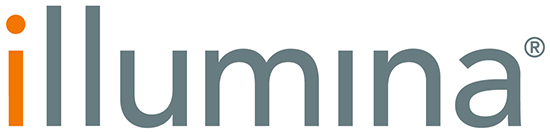

# Our Sponsors

We are grateful to our generous sponsors for their support.

---

## 🥇 Gold Sponsors

|  |  |  |
|:--:|:--:|:--:|
| Element Bioscience | PacBio | Roche |

---

## 🥈 Silver Sponsors

|  |  |  |
|:--:|:--:|:--:|
| 10x Genomics | Agilent | Biomodal |

---

|  |  |  |
|:--:|:--:|:--:|
| DxNE | Dovetail | Earlham Institute  |

---

|  |  |  |
|:--:|:--:|:--:|
| Illumina | New England Biolabs | ONT |

---

|  |  |  |
|:--:|:--:|:--:|
| ParseBio | Takara | Twist |

---

|  | 
|:--:|
| Yourgene Health | 

---

## 🥉 Bronze Sponsors

|  |  |  |
|:--:|:--:|:--:|
| Watchmaker | Scale | Vazyme |

---

Thank you to all our supporters!
