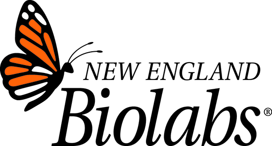
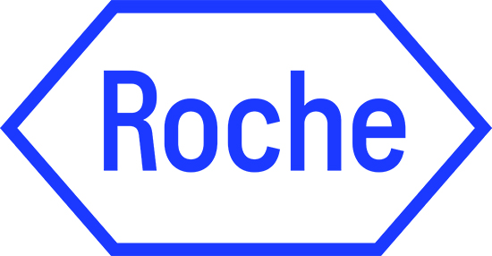
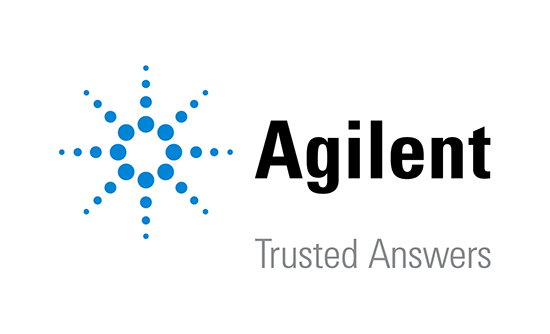
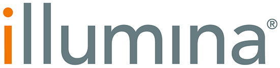
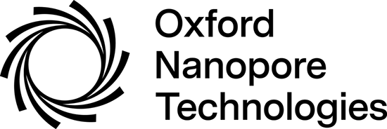
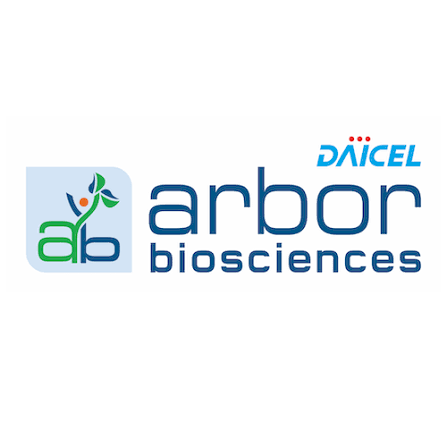

# Our Sponsors

We are grateful to our generous sponsors for their support.

---

## 🥇 Gold Sponsors

|  |  |  |
|:--:|:--:|:--:|
| 10x Genomics | Beckman Coulter | Element Biosciences |

|  |  |  |
|:--:|:--:|:--:|
| Lightcast | New England Biolabs | Roche |
---

## 🥈 Silver Sponsors

|  |  |  |
|:--:|:--:|:--:|
| Agilent | Illumina | Oxford Nanopore Technologies |

---

## 🥉 Bronze Sponsors

|  |  |  |
|:--:|:--:|:--:|
| Daciel Arbor Biosciences | Dovetail Genomics | Singleron |

|  |  |  |
|:--:|:--:|:--:|
| Ultimagen | Watchmaker Genomics |  |
---

Thank you to all our supporters!

